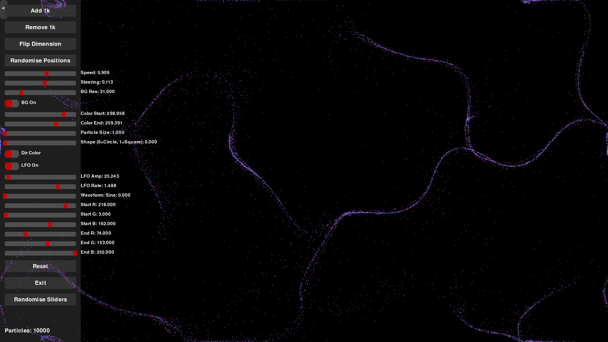

# Perlin Particle Playground

A real-time, interactive particle simulation and visualizer using Perlin noise, built with Python and Pygame.

## Features

- **Perlin Noise Flow**: Particles move along dynamic, noise-generated vector fields.
- **Fully Customizable UI**: 
  - Add/remove particles in real time
  - Speed, steering, and shape sliders
  - Color range pickers (HSV and RGB)
  - Directional color mapping toggle
  - LFO (Low Frequency Oscillator) with waveform selection (sine, square, triangle, saw)
  - Density-based background with adjustable resolution and toggle
  - Randomize and reset controls
  - Collapsible vertical menu for a clean workspace
- **Performance Optimized**: Handles thousands of particles smoothly.
- **Instant Feedback**: All controls update the simulation in real time.

## Controls

- **Add 1k / Remove 1k**: Instantly add or remove 1,000 particles.
- **Randomise Positions**: Scatter all particles randomly.
- **Speed/Steering/Shape/Size Sliders**: Adjust particle movement and appearance.
- **Color Range (HSV/RGB)**: Pick custom color gradients for particles.
- **Directional Color Toggle**: Map color to movement direction or use static/interpolated RGB.
- **LFO Controls**: Modulate the noise field with amplitude, rate, and waveform.
- **Density BG**: Toggle and adjust a beautiful density-based background.
- **Reset**: Restore all controls to default.
- **Exit**: Quit the program.
- **Randomise Sliders**: Randomize all sliders (except particle size) for creative exploration.
- **Collapse Menu**: Use the tab to hide/show the menu for an unobstructed view.

## Requirements

- Python 3.7+
- pygame
- noise

Install dependencies with:

```
pip install pygame noise
```

## Usage

Run the simulation:

```
python main.py
```

## Screenshots



---

Created for creative coding, generative art, and interactive exploration. Tweak, play, and enjoy!
